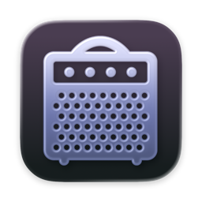
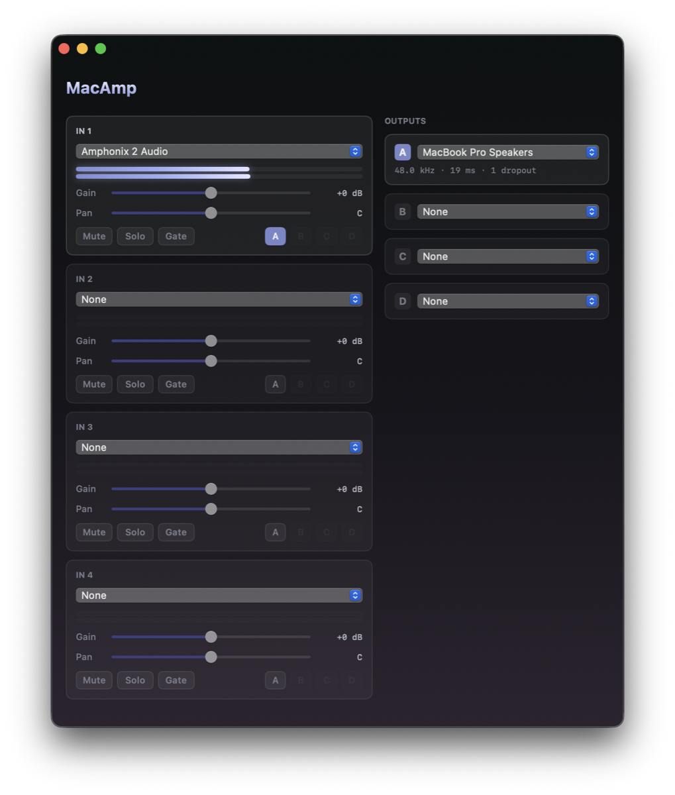

<p align="center">
  
</p>

<h1 align="center">MacAmp</h1>

A small live mixer for macOS. Plug in a guitar and a microphone, and route each
of them to any combination of output devices — the same one, different ones,
several at once — with per-source gain, pan, mute, solo, a noise gate and
metering. All live, all without opening a DAW.

Four inputs, four output buses, a routing matrix, and nothing else. The tone is
your hardware's business — MacAmp only does the part macOS itself refuses to.

<p align="center">
  
</p>

> A personal project, built for a Sonicake Amphonix 2 going into a MacBook Pro.
> Nothing about it is specific to that amp; any class-compliant USB audio input
> works. Not affiliated with Sonicake.

## Why

Plug a modelling headphone amp into a Mac over USB and macOS will happily record
it. It will not simply *play it back*. There is no system setting for "take this
input and put it on those speakers" — monitoring is a thing DAWs do, so the
normal answer is to launch GarageBand, make a project you will never save, arm a
track, and leave a 700 MB application running so that a guitar makes noise.

The obvious way to write the small version of that is `AVAudioEngine`, and it
does not work. **`AVAudioEngine` cannot use a different input and output
device.** Its `inputNode` and `outputNode` share a single `AUAudioUnit` with one
`deviceID`; set the input to your interface and the output bus collapses to
0 Hz / 0 channels, then crashes when you connect it to the mixer. This is
long-standing and documented, not a bug to be worked around.

So cross-device monitoring means dropping to the C API and driving two `AUHAL`
units by hand, with a lock-free ring buffer between them and something to absorb
the fact that the two devices' clocks disagree. That is the whole program.

### Prior art

**[Loopback](https://rogueamoeba.com/loopback/)** and
**[Audio Hijack](https://rogueamoeba.com/audiohijack/)** (Rogue Amoeba) are far
better programs than this one. They route anything to anything, with a node
graph, effects, and a virtual driver that other apps can see. If you want a
general audio routing tool, buy one of those — they are excellent and worth the
money.

**[BlackHole](https://github.com/ExistentialAudio/BlackHole)** is free and
superb, but it solves an adjacent problem: it is a virtual *device* for getting
audio between applications, not a router between two pieces of hardware.

**[LadioCast](https://apps.apple.com/app/ladiocast/id411213048)** is free and
genuinely does this. It is aimed at broadcasters, so the interface is four input
strips and a matrix of routing buttons.

MacAmp is smaller than all of them on purpose. There is no matrix, no graph, no
virtual device, and nothing to configure — because when the answer is always
"this interface to those speakers," there is nothing worth asking.

## How it fits together

```
  guitar ─▶ interface ─┐                                    ┌─▶ bus A ─▶ speakers
             44,100 Hz │   gate ▸ gain ▸ meter ▸ ring       │      48,000 Hz
                       ├──────────────────────────────┐     │
                       │                         routing    │
   mic ─▶ interface ─┐ │                          matrix ───┤
             48,000 Hz │   gate ▸ gain ▸ meter ▸ ring       │
                       └──────────────────────────────┘     └─▶ bus B ─▶ headphones
                                                                   44,100 Hz
```

Every input owns a ring buffer. Every output bus owns an independent read cursor
and resample phase **into each of those rings** — so one guitar can feed two
buses running at different rates off different clocks, each drift-corrected
separately, while a mic on a third clock is summed into one of them.

| File | Language | Role |
|---|---|---|
| `src/RingBuffer.c` | C | Lock-free ring, one producer and up to four independent consumers |
| `src/AudioBridge.c` | C | Every AUHAL unit, every render callback, gate, pan, mixing, resampling |
| `src/Devices.swift` | Swift | Enumeration, UID persistence, hot-plug watching |
| `src/App.swift` | Swift | The window: two pickers and a status line |

**The realtime path is C on purpose.** Render callbacks run on a CoreAudio
thread with a hard deadline, where allocation, locks, ARC traffic and Swift's
exclusivity checks are all unsafe. Writing them in C means the audio path
provably contains no Swift runtime, which you can check rather than take on
faith:

```bash
nm build/obj/AudioBridge.o | grep swift_    # returns nothing
```

## Install

```bash
git clone https://github.com/adamkbritsch/macamp.git
cd macamp
./build.sh
./install.sh
```

Use `install.sh` rather than copying the bundle by hand. Replacing an app in
place leaves its old LaunchServices registration behind, and once a few have
accumulated `open` will launch a broken instance that runs **with no window at
all** — while running the binary directly still works perfectly. It looks like
an app bug and is not one. `install.sh` unregisters before replacing and
re-registers after.

Then open it. Monitoring starts on launch and stops when you quit — there is no
on switch, because an app you opened deliberately is the on switch.

**macOS will ask for microphone access the first time.** Grant it. Capturing
from *any* audio input needs TCC authorisation, including USB interfaces that
are not microphones. This matters more than it sounds: **when access is denied,
CoreAudio returns digital silence rather than an error**, so an app that skips
the check looks like it is working and plays nothing. MacAmp checks explicitly
and tells you.

## Requirements

- **Apple Silicon Mac, macOS 13+.** Built and tested on macOS 26.
- **Command Line Tools** are enough for the app itself — `swiftc` compiles
  SwiftUI fine, and there is no Xcode project or `xcodebuild` anywhere.
- **Full Xcode, for the icon only.** `MacAmp.icon` is an Icon Composer bundle
  and `actool` ships with Xcode rather than Command Line Tools. Because
  `xcode-select` typically points at Command Line Tools, `xcrun` will not find
  it, so `build.sh` tries `xcrun` first and falls back to the absolute path
  inside `Xcode.app`. Without Xcode the build still succeeds and simply warns
  that the app will have no icon.
- **A class-compliant USB audio input.** Anything macOS shows in the input list.

## What it does

- **Four inputs, four output buses, any routing between them.** Send the guitar
  to the speakers and the mic to headphones; send both to both; solo one to
  check it. Each input carries gain, pan, mute, solo and a noise gate.
- **Mixes sources that do not share a clock.** A guitar interface at 44.1 kHz
  and a mic at 48 kHz are two independent crystals, and summing them means
  resampling each against the destination separately.
- **Metering that reads like audio.** Peak is captured on the audio thread and
  cleared on read, so a transient between UI frames cannot be missed, and the
  scale is dBFS across the top 60 dB rather than linear.
- **A noise gate per input**, with fast attack so a note's transient survives
  and slow release so it does not chatter on a decay. Useful on a mic in a room
  with a fan; useful on a high-gain amp patch that hisses.
- **Remembers everything by device UID**, never by `AudioDeviceID` — those get
  reassigned across reboots, so an app that persists the number reopens
  pointing at whatever inherited it.
- **Defaults output to the built-in speakers** rather than the system default.
  A virtual driver that has installed itself as "default output" — Boom 3D,
  Teams, Steam, a Multi-Output Device — would otherwise swallow the signal.
- **Refuses to route a device into itself.** Many USB interfaces advertise both
  input and output endpoints, so they are legitimate output devices that are
  nonetheless never valid destinations here.
- **Survives unplugging.** Pull an interface and its strip empties; plug it back
  in and it returns.

### Clock drift

The devices run on independent crystals. At ±50 ppm each they can diverge by up
to 100 ppm — about **4.4 samples per second at 44.1 kHz, roughly 6 ms per
minute.** Left alone, a ring buffer drains or overflows within minutes and the
audio dies partway through a session.

So each output bus low-pass filters its backlog on each input it is reading and
nudges that pair's resample ratio, clamped to **±0.2%** — well under the ~0.6%
where pitch change becomes audible. Interpolation is cubic Hermite: transparent
at matched rates, materially cleaner than linear otherwise.

Two details that only matter once there is more than one consumer:

- The producer paces to the **furthest-behind** cursor, not the nearest, or a
  momentarily starved bus would have samples overwritten underneath it.
- A bus parked on an input it is **not currently listening to** — unrouted,
  muted, soloed out — still advances its cursor. Otherwise that idle bus would
  stall the ring for every other bus reading the same input.

If two devices can both reach 44.1 kHz, matching them in **Audio MIDI Setup**
removes the rate conversion entirely. MacAmp will not do this for you: a
device's nominal rate is shared state every other app on the machine sees.

### Feedback

A microphone routed to speakers is a feedback loop. MacAmp does not attempt to
detect or suppress it — there is no automatic notch or ducking — so mute is a
real control rather than a convenience. Summed buses are hard-limited at full
scale, which stops a runaway from wrapping into digital noise, but it will still
be loud. Use headphones for mic work.

### One thing it deliberately does not do

**There is no EQ and there are no effects.**

Not because they are hard, but because a modelling amp already has them, in
hardware, with its own editor. A second tone stage in software would mean
dialling in a sound on the amp and having it altered on the way out by a control
you forgot you set. Gain, pan and the gate exist because a mixer cannot balance
two sources without them. Tone shaping is a different job.

It also does not stream or encode. LadioCast's Icecast/RTMP/SHOUTcast half is
broadcast plumbing, and this is not a broadcast tool.

## Credits

Amp artwork from [SVG Repo](https://www.svgrepo.com/), recoloured and composited
in Icon Composer.

## Licence

MIT. See [LICENSE](LICENSE).
